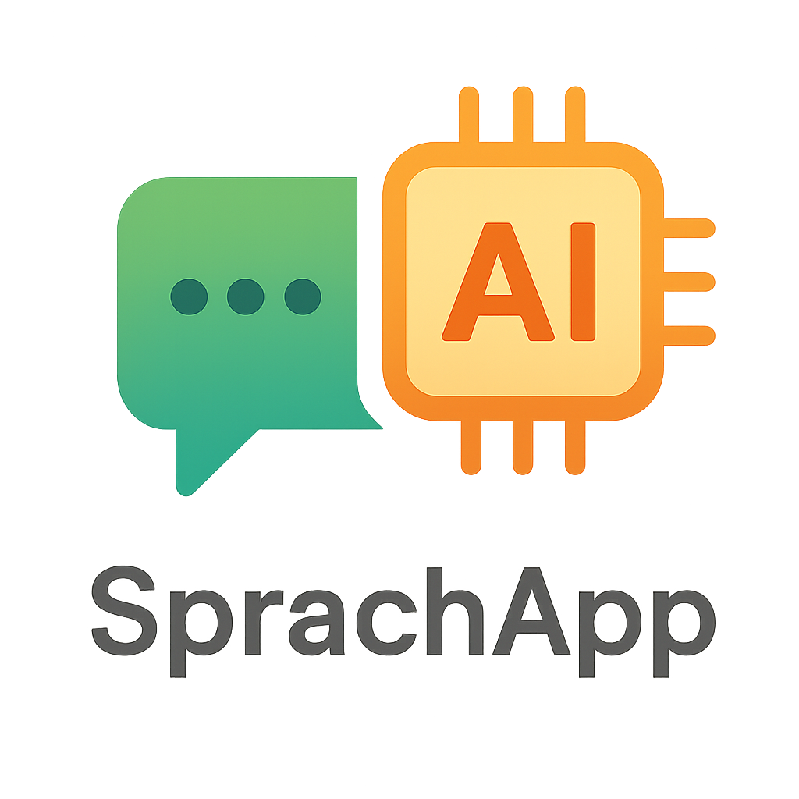

# SprachlernApp - Italienisch Lern-App

<p align="center">
  
</p>

Eine interaktive Web-Applikation zum Erlernen der italienischen Sprache, mit Fokus auf Satzstruktur und Grammatik.

## Features

- **Interaktives Satzspiel**: Drag & Drop Funktionalität zum Üben der italienischen Satzstellung
- **Glossar**: Detaillierte Erklärungen zu Wörtern und grammatikalischen Konzepten
- **CEFR-Level Anpassung**: Inhalte werden nach Sprachniveau (A1-C1) gefiltert
- **Farbkodierung**: Visuelle Unterscheidung von Wortarten
- **Satzstruktur-Analyse**: Automatische Erkennung von Subjekt, Verb und Objekt

## Technologien

- React
- Vite
- Tailwind CSS
- HTML5 Drag & Drop API

## Installation

1. Repository klonen:
```bash
git clone [repository-url]
```

2. Abhängigkeiten installieren:
```bash
npm install
```

3. Entwicklungsserver starten:
```bash
npm run dev
```

## Projektstatus

Das Projekt befindet sich in aktiver Entwicklung. Aktuelle Features sind funktionsfähig, weitere Verbesserungen sind geplant.

## Lizenz

[Lizenz hier einfügen] 